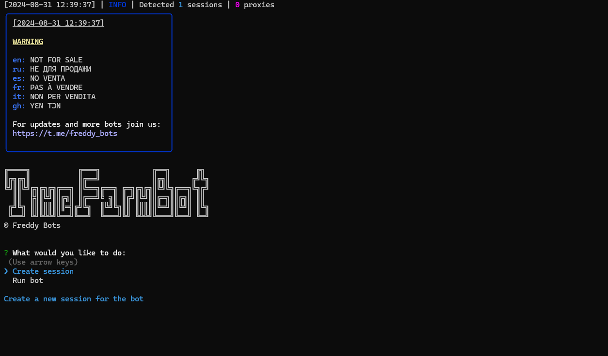

> [](https://t.me/roddyfred)



# Use Node.Js 18 or later

## Functionality

| Functional                            | Supported |
| ------------------------------------- | :-------: |
| Claiming daily reward                 |    ✅     |
| Claiming Farming reward               |    ✅     |
| Claiming Friends reward               |    ✅     |
| Claiming daily quiz reward            |    ✅     |
| Starting Farming                      |    ✅     |
| Multithreading                        |    ✅     |
| Using a session/query_id              |    ✅     |
| Binding a proxy to a session/query_id |    ✅     |
| Random sleep time between clicks      |    ✅     |

### [How to add query id](https://github.com/Freddywhest/RockyRabbitBot/blob/main/AddQueryId.md)

## [Settings](https://github.com/FreddyWhest/TimeFarmBot/blob/main/.env-example)

| Settings                   | Description                                                               |
| -------------------------- | ------------------------------------------------------------------------- |
| **API_ID / API_HASH**      | Platform data from which to launch a Telegram session (stock - Android)   |
| **CLAIM_FRIENDS_REWARD**   | Whether the bot should Claim friends rewards (True / False)               |
| **AUTO_FARMING**           | Whether the bot should start/claim farming (True / False)                 |
| **AUTO_DAILY_QUIZ**        | Whether the bot should claim daily quiz (True / False)                    |
| **SLEEP_BETWEEN_REQUESTS** | Delay between taps in seconds (eg. 70)                                    |
| **USE_PROXY_FROM_FILE**    | Whether to use proxy from the `bot/config/proxies.js` file (True / False) |
| **USE_QUERY_ID**           | Whether to query_id instead of sessions (True / False)                    |

## Installation

You can download [**Repository**](https://github.com/FreddyWhest/TimeFarmBot) by cloning it to your system and installing the necessary dependencies:

```shell
~ >>> git clone https://github.com/FreddyWhest/TimeFarmBot.git
~ >>> cd TimeFarmBot

#Linux and MocOS
~/TimeFarmBot >>> chmod +x check_node.sh
~/TimeFarmBot >>> ./check_node.sh

OR

~/TimeFarmBot >>> npm install
~/TimeFarmBot >>> cp .env-example .env
~/TimeFarmBot >>> nano .env # Here you must specify your API_ID and API_HASH , the rest is taken by default
~/TimeFarmBot >>> node index.js

#Windows
1. Double click on INSTALL.bat in TimeFarmBot directory to install the dependencies
2. Double click on START.bat in TimeFarmBot directory to start the bot

OR

~/TimeFarmBot >>> npm install
~/TimeFarmBot >>> cp .env-example .env
~/TimeFarmBot >>> # Specify your API_ID and API_HASH, the rest is taken by default
~/TimeFarmBot >>> node index.js
```

Also for quick launch you can use arguments, for example:

```shell
~/TimeFarmBot >>> node index.js --action=1

OR

~/TimeFarmBot >>> node index.js --action=2

#1 - Create session
#2 - Run clicker
```
